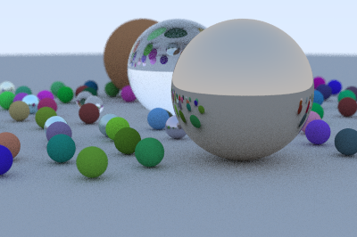

# RayTray

A small C++ path tracer built while studying [*Ray Tracing in One Weekend*](https://raytracing.github.io/books/RayTracingInOneWeekend.html), then extended with an OpenMP renderer for a parallel-computing course project. The repository credits both project contributors in the source; the renderer is an educational implementation, not a new path-tracing algorithm.



## What it demonstrates

- Sphere intersections, diffuse/metal/dielectric materials, recursive rays, antialiasing, depth of field and gamma correction.
- PPM image output from separate serial and OpenMP executables.
- Scanline-level parallel rendering with OpenMP `schedule(dynamic)` and thread-local PCG32 state.
- A seeded scene and per-scanline random streams, so the serial image and each OpenMP thread-count image use the same samples.

The included scene is small and uses a fixed 400 × 266 image, 50 samples per pixel and a maximum ray depth of 10. It has no spatial acceleration structure.

## Build

Requirements: CMake 3.16 or newer and a C++17 compiler. OpenMP is needed for the parallel target; CMake still builds the serial renderer if an OpenMP C++ runtime is unavailable.

```sh
cmake -S . -B build -DCMAKE_BUILD_TYPE=Release
cmake --build build --parallel
```

## Run

```sh
./build/raytracer
./build/raytracer_parallel
```

The serial executable writes `serial_output.ppm`. The OpenMP executable renders with 1, 2, 4, 8 and 16 threads, writes one `image_tN.ppm` per run, and saves timings to `benchmark_results.csv`. Files are written to the current working directory.

## Reading the benchmark output

The CSV reports render-loop time and speedup relative to the OpenMP run with one thread. It excludes scene construction and image-file output. Each thread count is measured once; the program does not warm up or repeat runs, record machine details, or control CPU load. Treat the CSV as a course-project timing demonstration, not a general performance claim. For a defensible comparison, repeat runs on an otherwise idle machine and report the hardware, compiler, build flags and summary statistic.

## Attribution and scope

This is a team course project by Prajwal Kumar K and Chandra Teja. Its learning path and core ray-tracing concepts follow *Ray Tracing in One Weekend*; the OpenMP work adds a separate parallel implementation. The book-series source repository is published under CC0: [RayTracing/raytracing.github.io](https://github.com/RayTracing/raytracing.github.io). This repository has no separate license file; ask both contributors before reusing project-specific changes.
